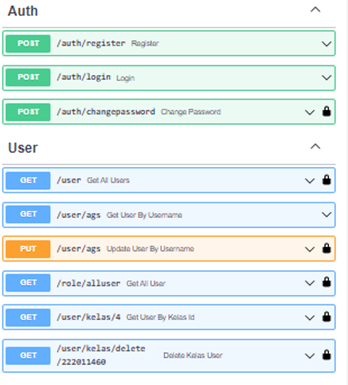
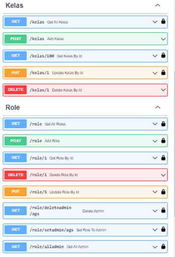
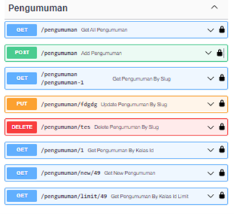

# Dokumentasi Stuna API

## Description

This is a RESTful API for Stuna App. This API is made with PHP and Codeigniter 4 framework.

## Screenshots

## Tentang

Kode ini dibawah lisensi MIT. Silahkan baca [Lisensi](license.txt) untuk informasi lebih lanjut.

Restful API ini dibuat dengan bahasa pemrograman PHP dan menggunakan framework [Codeigniter 4](https://codeigniter.com/).

## Instalasi

Silahkan ikuti langkah-langkah berikut untuk menginstall Stuna API.

1. Clone repository ini
2. Masuk ke direktori repository
3. Jalankan perintah `composer install`
4. Buat file `.env` dengan meng-copy file `.env.example`
5. Buat database baru untuk Stuna API
6. Isi konfigurasi database di file `.env`
7. Jalankan perintah `php spark migrate:refresh`
8. Jalankan perintah `php spark db:seed RoleSeder`
9. Jalankan perintah `php spark db:seed KelasSeeder`
10. Jalankan perintah `php spark db:seed AuthSeeder`
11. Jalankan perintah `php spark db:seed UserSeeder`
12. Jalankan perintah `php spark db:seed PengumumanSeeder `
13. Jika tidak ingin melakukan php spark, bisa juga dengan mengimport file sql [stuna.sql](tambahan/stuna.sql) yang ada di folder `tambahan` ke database yang sudah dibuat

## Penggunaan API

1. Jalankan perintah `php spark serve`
2. Gunakan rest client untuk mengakses API. Contoh: [Postman](https://www.postman.com/)
3. Cek dokumentasi endpoint Stuna API dengan mengimport file [stuna-api.postman_collection.json](tambahan/Stuna.postman_collection.json) ke Postman
4. Selain itu terdapat juga file yaml [stuna-api.openapi_collection.yaml](tambahan/Stuna.openapi_collection.yaml) yang bisa digunakan untuk Swagger Editor
